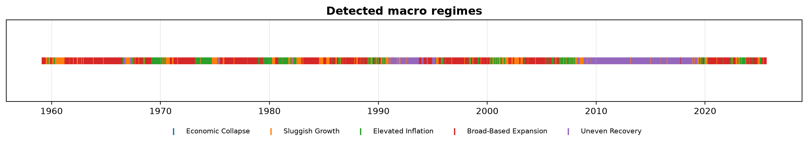
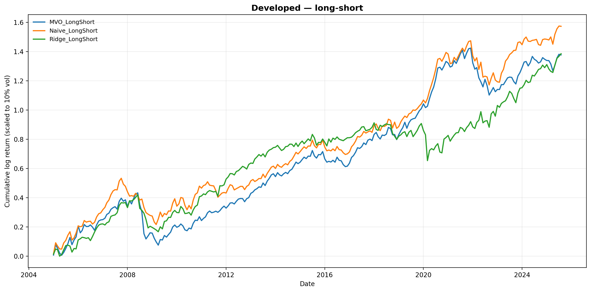

# Macro-Regime Tactical Asset Allocation

Detect the prevailing macro regime from 120+ FRED-MD indicators (PCA → two-step
KMeans), then tilt a global-equity book toward what has historically paid off in
that regime. On a 1959–2025 walk-forward backtest the regime-aware strategies earn
roughly **2× the annual return of an equal-weight benchmark** at a comparable or
better Sharpe.



## The idea

Equities don't have one return distribution — they have several, depending on the
macro backdrop (broad expansion, sluggish growth, an inflation scare, an outright
collapse). If you can label the current regime from the data, you can size positions
using the return/risk profile that regime tends to produce, instead of one blended
average that fits none of them.

This project does exactly that, end to end: build a stationary macro panel, cluster
it into regimes, forecast regime-conditional returns, and run a proper walk-forward
backtest against an equal-weight benchmark across developed and emerging equities.

## Results

Walk-forward, monthly, 48-month lookback, 248 out-of-sample months. Returns are
volatility-scaled to 10% annual for comparison. Sharpe/Sortino are ratios; the rest
are percentages.

**Developed markets**

| Strategy | Sharpe | Sortino | Ann. Return | Ann. Vol | Max DD | Hit Rate |
|---|---|---|---|---|---|---|
| Naive Long-Short | **0.76** | 1.05 | 14.97 | 19.67 | 48.81 | 60.9 |
| Naive Long-Only | 0.69 | 0.91 | 12.44 | 18.14 | 53.25 | 61.7 |
| Ridge Long-Short | 0.67 | 0.80 | 14.98 | 22.34 | 51.88 | 62.9 |
| MVO Long-Short | 0.67 | 0.85 | 13.46 | 20.20 | 55.43 | 62.5 |
| MVO Long-Only | 0.59 | 0.71 | 10.54 | 17.90 | 58.79 | 62.1 |
| Ridge Long-Only | 0.42 | 0.51 | 8.38 | 19.80 | 47.19 | 60.9 |
| Equal-Weight (benchmark) | 0.37 | 0.45 | 5.51 | 14.94 | 54.95 | 60.5 |

**Emerging markets**

| Strategy | Sharpe | Sortino | Ann. Return | Ann. Vol | Max DD | Hit Rate |
|---|---|---|---|---|---|---|
| Naive Long-Short | **0.65** | 1.02 | 14.08 | 21.54 | 44.98 | 58.1 |
| Ridge Long-Short | 0.57 | 0.94 | 12.82 | 22.35 | 47.55 | 56.9 |
| Naive Long-Only | 0.52 | 0.76 | 10.15 | 19.59 | 47.17 | 59.3 |
| MVO Long-Only | 0.48 | 0.67 | 10.35 | 21.75 | 60.93 | 57.7 |
| Ridge Long-Only | 0.44 | 0.64 | 9.36 | 21.20 | 54.18 | 60.5 |
| MVO Long-Short | 0.36 | 0.48 | 8.49 | 23.86 | 65.27 | 57.7 |
| Equal-Weight (benchmark) | 0.31 | 0.40 | 5.95 | 19.24 | 61.04 | 57.7 |

The regime-conditional **Naive** forecaster — just the regime's historical mean
return — is the consistent winner, a useful reminder that a good state variable
beats a fancier model on a noisy one.



## How it works

1. **Data** (`data/fredmd_loader.py`) — FRED-MD's ~120 US macro series, each made
   stationary with its own FRED transform code (log-diff, differencing, …). FX
   series are dropped before clustering.
2. **Regime detection** (`regimes/detection.py`) — standardise → PCA (95% variance)
   → KMeans(k=2) to split crisis from typical months → KMeans(k\*) on the typical
   months for the sub-regimes, with k\* chosen by silhouette. Everything is fit on
   the pre-2024 training window; later months are classified out-of-sample via soft
   probabilities.
3. **Forecasting** (`models/forecast.py`) — regime-conditional expected returns,
   either the regime's sample mean (*Naive*) or a per-regime *Ridge* on the PCA
   factors.
4. **Allocation** (`models/allocation.py`) — mean-variance optimisation, long-only
   (weights ≥ 0, fully invested) or long-short (net 100%, gross ≤ 200%).
5. **Backtest** (`backtest/engine.py`) — one 48-month rolling loop scores all seven
   strategies on identical inputs and compares them to equal-weight.

## The math

**Dimension reduction.** The stationarised panel is standardised and projected onto
its leading principal components — eigenvectors of the sample correlation matrix,
retained to 95% cumulative variance ($\sum_{i\le k}\lambda_i / \sum_i \lambda_i \ge 0.95$).
This compresses ~120 collinear indicators into a handful of orthogonal macro factors
before any clustering.

**Regimes.** K-Means minimises within-cluster variance,
$\min \sum_c \sum_{x \in c} \lVert x - \mu_c \rVert^2$. Crisis months are so extreme
they'd dominate a single clustering, so it's done in two steps: $k=2$ first isolates
crisis vs. typical, then the typical months are re-clustered with $k^\*$ chosen by
silhouette score. Out-of-sample months get soft regime probabilities from a softmax
over (negative) distances to the fitted centroids — no refitting on test data.

**Forecast and allocation.** The *Naive* forecast is the regime-conditional sample
mean $\hat\mu_r = \bar r_{\,t \in r}$; *Ridge* regresses returns on the PCA factors
with an $\ell_2$ penalty, $\min_w \lVert y - Fw \rVert^2 + \lambda \lVert w \rVert^2$,
fit per regime. Weights come from mean-variance optimisation
($\max_w\; w^\top\mu - \tfrac{\gamma}{2} w^\top \Sigma w$) under long-only
($w_i \ge 0$, $\sum w_i = 1$) or long-short (net 100%, gross $\le$ 200%) constraints.

## References

- Markowitz, H. (1952), *Portfolio Selection*, Journal of Finance 7(1).
- Ang, A. & Bekaert, G. (2004), *How Regimes Affect Asset Allocation*, Financial Analysts Journal 60(2) — the case for regime-conditional allocation.
- McCracken, M. & Ng, S. (2016), *FRED-MD: A Monthly Database for Macroeconomic Research*, Journal of Business & Economic Statistics 34(4) — the data and the stationarity transform codes.
- Hoerl, A. & Kennard, R. (1970), *Ridge Regression*, Technometrics 12(1).

## Project layout

```
macro-regime-allocation/
├── data/raw/                # FRED-MD + MSCI inputs
├── src/macro_regime/
│   ├── data/                # fredmd_loader, msci_loader, series_names
│   ├── regimes/             # detection, naming
│   ├── models/              # forecast (naive/ridge), allocation (MVO)
│   ├── backtest/            # walk-forward engine
│   ├── analytics/           # performance metrics
│   ├── viz/                 # equity curves + regime timeline
│   ├── config.py            # paths, seed, train/test cutoff
│   └── cli.py               # end-to-end entry point
├── results/                 # generated CSVs + charts
└── pyproject.toml           # uv-managed
```

## Running it

```bash
uv sync                 # create the env from pyproject.toml
uv run macro-regime     # run both universes -> results/

# options
uv run macro-regime --universe developed
uv run macro-regime --universe emerging -v
```

Outputs land in `results/<universe>/` (performance CSVs + cumulative-return charts)
plus a shared `results/regime_timeline.png`.

## Data

- **FRED-MD** — McCracken & Ng's monthly macro database (public, St. Louis Fed).
- **MSCI** — monthly developed- and emerging-market sector indices, used here under
  academic/educational fair use to demonstrate the method.

## Notes & caveats

- Returns are monthly log returns; the backtest is gross of transaction costs and
  assumes month-end execution — fine for a research comparison, not a live P&L claim.
- Regime names ("Broad-Based Expansion", etc.) are descriptive labels read off the
  cluster profiles, not formal NBER-style datings.
- The crisis regime is rare by construction (a handful of months like 2020-04), so
  its covariance falls back to the rolling-sample estimate.

---

Built by Tejas Pandya. The methodology grew out of a graduate financial-risk-modeling
project; this repository is my own from-scratch reimplementation and packaging.
