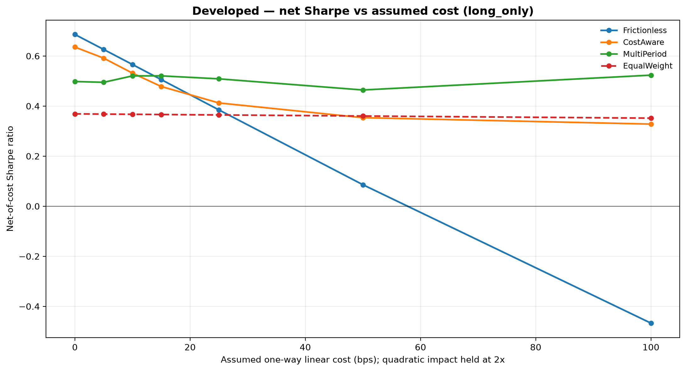

# Macro-Regime Tactical Asset Allocation

Detect the prevailing macro regime from 120+ FRED-MD indicators (PCA → two-step
KMeans), then tilt a global-equity book toward what has historically paid off in
that regime. On a 1959–2025 walk-forward backtest the regime-aware strategies earn
roughly **2× the annual return of an equal-weight benchmark** at a comparable or
better Sharpe.

A second layer asks whether any of that survives trading costs. Position sizing is
reformulated as a **convex program with transaction costs inside the objective**
(cvxpy, MOSEK-first solver policy) and solved over a receding horizon on a
Markov-projected regime forecast. The headline finding is not that the cost-aware
optimiser wins everywhere — below ~13bps it doesn't — but that its net Sharpe is
**nearly invariant to the cost assumption** (0.50–0.52 from 0 to 100bps) while the
frictionless book's decays to **negative** over the same range. See
[Trading costs](#trading-costs-the-convex-layer).


## The idea

Equities don't have one return distribution — they have several, depending on the
macro backdrop (broad expansion, sluggish growth, an inflation scare, an outright
collapse). If you can label the current regime from the data, you can size positions
using the return/risk profile that regime tends to produce, instead of one blended
average that fits none of them.

This project does exactly that, end to end: build a stationary macro panel, cluster
it into regimes, forecast regime-conditional returns, and run a proper walk-forward
backtest against an equal-weight benchmark across developed and emerging equities.

## Results

Walk-forward, monthly, 48-month lookback, 248 out-of-sample months. Returns are
volatility-scaled to 10% annual for comparison. Sharpe/Sortino are ratios; the rest
are percentages.

**Developed markets**

| Strategy | Sharpe | Sortino | Ann. Return | Ann. Vol | Max DD | Hit Rate |
|---|---|---|---|---|---|---|
| Naive Long-Short | **0.76** | 1.05 | 14.97 | 19.67 | 48.81 | 60.9 |
| Naive Long-Only | 0.69 | 0.91 | 12.44 | 18.14 | 53.25 | 61.7 |
| Ridge Long-Short | 0.67 | 0.80 | 14.98 | 22.34 | 51.88 | 62.9 |
| MVO Long-Short | 0.67 | 0.85 | 13.46 | 20.20 | 55.43 | 62.5 |
| MVO Long-Only | 0.59 | 0.71 | 10.54 | 17.90 | 58.79 | 62.1 |
| Ridge Long-Only | 0.42 | 0.51 | 8.38 | 19.80 | 47.19 | 60.9 |
| Equal-Weight (benchmark) | 0.37 | 0.45 | 5.51 | 14.94 | 54.95 | 60.5 |

**Emerging markets**

| Strategy | Sharpe | Sortino | Ann. Return | Ann. Vol | Max DD | Hit Rate |
|---|---|---|---|---|---|---|
| Naive Long-Short | **0.65** | 1.02 | 14.08 | 21.54 | 44.98 | 58.1 |
| Ridge Long-Short | 0.57 | 0.94 | 12.82 | 22.35 | 47.55 | 56.9 |
| Naive Long-Only | 0.52 | 0.76 | 10.15 | 19.59 | 47.17 | 59.3 |
| MVO Long-Only | 0.48 | 0.67 | 10.35 | 21.75 | 60.93 | 57.7 |
| Ridge Long-Only | 0.44 | 0.64 | 9.36 | 21.20 | 54.18 | 60.5 |
| MVO Long-Short | 0.36 | 0.48 | 8.49 | 23.86 | 65.27 | 57.7 |
| Equal-Weight (benchmark) | 0.31 | 0.40 | 5.95 | 19.24 | 61.04 | 57.7 |

The regime-conditional **Naive** forecaster — just the regime's historical mean
return — is the consistent winner, a useful reminder that a good state variable
beats a fancier model on a noisy one.


## Trading costs: the convex layer

Every number above is **gross**. That flatters whichever strategy has the jumpiest
weights, because the backtest banks its alpha and never pays the spread. The
`--costs` path re-runs the whole thing as a single book carried through time —
weights drift with returns, get rebalanced, and the trade is charged — comparing
three ways of choosing the target book, all debited by the *same* cost model:

| | what it does |
|---|---|
| **Frictionless** | the mean-variance weights from above, charged anyway |
| **CostAware** | single-period convex solve with costs inside the objective |
| **MultiPeriod** | receding-horizon solve over a Markov-projected forecast path |

**Developed, long-only, net of 10bps linear + 20bps quadratic impact:**

| Strategy | Gross Sharpe | Net Sharpe | Sharpe Lost | Ann. Turnover | Ann. Cost | Net Ann. Return |
|---|---|---|---|---|---|---|
| Frictionless | 0.686 | **0.566** | 0.120 | 4.36× | 217 bps | 10.27 |
| CostAware | 0.606 | 0.531 | 0.075 | 2.99× | 142 bps | 10.02 |
| MultiPeriod | 0.535 | 0.520 | **0.014** | **0.84×** | **28 bps** | 10.16 |
| Equal-Weight | 0.369 | 0.367 | 0.002 | 0.13× | 3 bps | 5.49 |

At 10bps the frictionless book still wins on net Sharpe. That is the honest result
and it's worth stating plainly: the optimiser cuts turnover 5× and cost drag 8×,
but gives up enough gross alpha doing it that cheap trading doesn't repay the
discipline. The interesting question is therefore not "which is better" but **at
what cost level does the answer flip**:



| linear bps | Frictionless | CostAware | MultiPeriod | best |
|---|---|---|---|---|
| 0 | 0.686 | 0.636 | 0.498 | Frictionless |
| 5 | 0.626 | 0.591 | 0.495 | Frictionless |
| 10 | 0.566 | 0.531 | 0.520 | Frictionless |
| 15 | 0.506 | 0.478 | **0.521** | MultiPeriod |
| 25 | 0.385 | 0.412 | **0.509** | MultiPeriod |
| 50 | 0.086 | 0.354 | **0.464** | MultiPeriod |
| 100 | **−0.467** | 0.328 | **0.523** | MultiPeriod |

The crossover sits between **12.5 and 15bps** (same ordering in emerging markets,
which crosses in the same band). Two things are worth more than the crossover
itself:

1. **The multi-period line is flat.** Net Sharpe moves 0.498 → 0.523 across a
   0–100bps sweep. The impact coefficient here is *assumed*, not fitted from ADV or
   tick data — so a conclusion that survives a 20× move in that assumption is worth
   considerably more than a single point estimate that doesn't.
2. **The frictionless line goes negative.** By 100bps the ungoverned book has a
   Sharpe of −0.47: all of its apparent edge was an artifact of not paying to trade.

Same net annual return (10.16 vs 10.27) at **one-fifth the turnover** is also the
capacity argument — the multi-period book is the one that could actually be run at
size.

## The convex program

The frictionless sizer maximises $w^\top\mu - \tfrac{\gamma}{2}w^\top\Sigma w$ and
re-solves from scratch monthly, so it is free to reverse the entire book for a
basis point of expected edge. Charging the trade means optimising over the *move*
from the current holdings $w_{\text{prev}}$, with $\Delta = w - w_{\text{prev}}$:

$$\max_{w}\;\; \mu^\top w \;-\; \frac{\gamma}{2}\,w^\top\Sigma w \;-\; \underbrace{\kappa\lVert\Delta\rVert_1}_{\text{spread, fees}} \;-\; \underbrace{\eta\sum_i |\Delta_i|^{p}}_{\text{market impact}}$$

subject to $\mathbf{1}^\top w = 1$ and either $w \ge 0$ (long-only) or
$\lVert w\rVert_1 \le 2$ (long-short, net 100% / gross 200%).

The linear term is what you always pay; the second is impact, superlinear in trade
size, with $p=2$ the quadratic case and $p=1.5$ the square-root law from the impact
literature. Every term is concave in $w$ and the feasible set is convex, so a
returned solution is the **global** optimum — which is the substantive reason for
leaving SLSQP behind, not solver preference.

**Multi-period.** Over an $H$-month horizon, with $w_0 = w_{\text{prev}}$:

$$\max_{w_1,\dots,w_H}\;\sum_{h=1}^{H}\delta^{\,h-1}\Big[\mu_h^\top w_h - \frac{\gamma}{2}w_h^\top\Sigma w_h - c(w_h - w_{h-1})\Big]$$

Only $w_1$ is executed; next month the whole path is re-solved on fresh forecasts
(receding horizon / MPC, following Boyd et al.). This matters because the cost of
entering a position is paid once while the edge accrues for as long as the position
is worth holding — so the optimiser sizes today's trade by how *persistent* the
forecast is. On a controlled example, total notional traded moves monotonically
with persistence: $\mu,\mu,\mu \to 1.52$; $\mu,\tfrac{1}{2}\mu,0.1\mu \to 1.12$;
$\mu,-\mu,-\mu \to 0.82$; $\mu,0,0 \to 0.64$ (single-period: 0.67).

**Where the forecast path comes from.** Regime labels are treated as a first-order
Markov chain, $p_{t+h} = p_t P^h$, with Laplace-smoothed transition counts so a
rare state (the crisis regime is sometimes a single month) still yields a usable
row. Blending the per-regime means under $p_{t+h}$ gives $\mu_h$. Because regimes
are persistent, the projected forecast decays smoothly toward the chain's
stationary distribution instead of being assumed to hold forever or vanish after a
month — and that decay profile is exactly what the optimiser trades against.

### Why a conic solver, and what MOSEK does

The objective is not differentiable ($\lVert\cdot\rVert_1$) and not a plain QP once
$p = 1.5$, so it is put in **conic** form via epigraph variables:

- **Turnover.** $\lVert\Delta\rVert_1 \le \mathbf{1}^\top t$ with $-t \le \Delta \le t$ — linear.
- **Risk.** $\Sigma = LL^\top$ (Cholesky), so $w^\top\Sigma w = \lVert L^\top w\rVert_2^2 \le s$
  is the rotated second-order cone $\big(\tfrac{s+1}{2}, \tfrac{s-1}{2}, L^\top w\big) \in \mathcal{Q}_r$.
  Factorising also sidesteps the numerically-indefinite sample covariance that trips
  a naive `quad_form` PSD check.
- **Impact.** $|\Delta_i|^{3/2} \le u_i$ is the three-dimensional **power cone**
  $(u_i, 1, \Delta_i) \in \mathcal{P}_3^{2/3,\,1/3}$.

MOSEK is a primal-dual **interior-point** solver over exactly these cones, on the
homogeneous self-dual embedding — it returns a primal-dual pair whose duality gap
is a *certificate* of optimality (or a certificate of infeasibility), converging in
$O(\sqrt{\nu}\log(1/\varepsilon))$ Newton steps for barrier parameter $\nu$. That
certificate is the practical difference from a local NLP method: a solution is
provably optimal rather than merely converged. MOSEK is also one of the few solvers
with native power-cone support, which is what makes the $p=1.5$ impact model
tractable rather than requiring a piecewise-linear approximation.

**Solver policy.** MOSEK is *preferred, not required*. `solve` walks
`("MOSEK", "CLARABEL", "SCS", "OSQP")` and takes the first that is installed and
solves, so the repo runs without a commercial licence and CI stays green. MOSEK
raises its licence error at solve time rather than import time, so the fallback is
caught there rather than guessed at up front. Every `OptimizationResult` records
which solver actually ran and whether it fell back, so a set of numbers can be
traced to the code path that produced it.

> **Reproducibility note.** The results above were produced on **MOSEK 11.2.2**
> under an academic licence — 496 solves per cost level per universe, **zero
> fallbacks**, including the $p=1.5$ power-cone model. Reproduce with
> `uv sync --extra mosek` and a licence at `~/mosek/mosek.lic`; without one the
> policy falls through to CLARABEL and everything still runs.
>
> **Solver independence.** Every figure above is identical to three decimal places
> under CLARABEL, which is the expected result for a convex program: the optimum is
> a property of the problem, not of the code path. A parametrised regression test
> (`test_mosek_and_clarabel_agree`, over both the QP and the power cone) pins the
> two solvers to `atol=1e-3` on weights and `rtol=1e-6` on the objective, and skips
> itself when MOSEK isn't licensed. Measured agreement on the reference problem is
> 1.3e-4 (QP) and 5.6e-6 (power cone). The frictionless arm is bit-identical across
> solvers because it never touches the conic path — it's still SLSQP.

## How it works

1. **Data** (`data/fredmd_loader.py`) — FRED-MD's ~120 US macro series, each made
   stationary with its own FRED transform code (log-diff, differencing, …). FX
   series are dropped before clustering.
2. **Regime detection** (`regimes/detection.py`) — standardise → PCA (95% variance)
   → KMeans(k=2) to split crisis from typical months → KMeans(k\*) on the typical
   months for the sub-regimes, with k\* chosen by silhouette. Everything is fit on
   the pre-2024 training window; later months are classified out-of-sample via soft
   probabilities.
3. **Forecasting** (`models/forecast.py`) — regime-conditional expected returns,
   either the regime's sample mean (*Naive*) or a per-regime *Ridge* on the PCA
   factors.
4. **Allocation** (`models/allocation.py`) — mean-variance optimisation, long-only
   (weights ≥ 0, fully invested) or long-short (net 100%, gross ≤ 200%).
5. **Backtest** (`backtest/engine.py`) — one 48-month rolling loop scores all seven
   strategies on identical inputs and compares them to equal-weight.
6. **Cost-aware optimisation** (`models/optimization.py`) — the convex program
   above: `CostModel`, `Constraints`, single-period and receding-horizon solvers,
   and the MOSEK-first solver policy.
7. **Regime persistence** (`regimes/transitions.py`) — Markov transition matrix and
   the projected forecast path the multi-period solver consumes.
8. **Cost-aware backtest** (`backtest/cost_aware.py`) — carries one book through
   time with drift, charges every strategy the same model, reports net-of-cost
   performance beside turnover.

## The math

**Dimension reduction.** The stationarised panel is standardised and projected onto
its leading principal components — eigenvectors of the sample correlation matrix,
retained to 95% cumulative variance ($\sum_{i\le k}\lambda_i / \sum_i \lambda_i \ge 0.95$).
This compresses ~120 collinear indicators into a handful of orthogonal macro factors
before any clustering.

**Regimes.** K-Means minimises within-cluster variance,
$\min \sum_c \sum_{x \in c} \lVert x - \mu_c \rVert^2$. Crisis months are so extreme
they'd dominate a single clustering, so it's done in two steps: $k=2$ first isolates
crisis vs. typical, then the typical months are re-clustered with $k^\*$ chosen by
silhouette score. Out-of-sample months get soft regime probabilities from a softmax
over (negative) distances to the fitted centroids — no refitting on test data.

**Forecast and allocation.** The *Naive* forecast is the regime-conditional sample
mean $\hat\mu_r = \bar r_{\,t \in r}$; *Ridge* regresses returns on the PCA factors
with an $\ell_2$ penalty, $\min_w \lVert y - Fw \rVert^2 + \lambda \lVert w \rVert^2$,
fit per regime. Weights come from mean-variance optimisation
($\max_w\; w^\top\mu - \tfrac{\gamma}{2} w^\top \Sigma w$) under long-only
($w_i \ge 0$, $\sum w_i = 1$) or long-short (net 100%, gross $\le$ 200%) constraints.

## References

- Markowitz, H. (1952), *Portfolio Selection*, Journal of Finance 7(1).
- Ang, A. & Bekaert, G. (2004), *How Regimes Affect Asset Allocation*, Financial Analysts Journal 60(2) — the case for regime-conditional allocation.
- McCracken, M. & Ng, S. (2016), *FRED-MD: A Monthly Database for Macroeconomic Research*, Journal of Business & Economic Statistics 34(4) — the data and the stationarity transform codes.
- Hoerl, A. & Kennard, R. (1970), *Ridge Regression*, Technometrics 12(1).
- Boyd, S., Busseti, E., Diamond, S., Kahn, R., Koh, K., Nystrup, P. & Speth, J. (2017), *Multi-Period Trading via Convex Optimization*, Foundations and Trends in Optimization 3(1) — costs inside the objective, receding-horizon execution.
- Almgren, R. & Chriss, N. (2000), *Optimal Execution of Portfolio Transactions*, Journal of Risk 3(2) — the impact/risk trade-off the cost model discretises.
- Grinold, R. & Kahn, R. (1999), *Active Portfolio Management*, 2nd ed. — turnover, capacity, and the cost of chasing signal.
- Hamilton, J. (1989), *A New Approach to the Economic Analysis of Nonstationary Time Series and the Business Cycle*, Econometrica 57(2) — Markov regime switching.
- MOSEK ApS (2024), *MOSEK Modeling Cookbook* — conic reformulations and the power cone used for the $p=1.5$ impact term.

## Project layout

```
macro-regime-allocation/
├── data/raw/                # FRED-MD + MSCI inputs
├── src/macro_regime/
│   ├── data/                # fredmd_loader, msci_loader, series_names
│   ├── regimes/             # detection, naming, transitions (Markov chain)
│   ├── models/              # forecast (naive/ridge), allocation (MVO),
│   │                        #   optimization (convex, cost-aware, MOSEK-first)
│   ├── backtest/            # engine (gross) + cost_aware (net, drift-tracked)
│   ├── analytics/           # performance metrics
│   ├── viz/                 # equity curves, regime timeline, cost sensitivity
│   ├── config.py            # paths, seed, train/test cutoff
│   └── cli.py               # end-to-end entry point
├── results/                 # generated CSVs + charts
└── pyproject.toml           # uv-managed
```

## Running it

```bash
uv sync                 # create the env from pyproject.toml
uv run macro-regime     # run both universes -> results/

# options
uv run macro-regime --universe developed
uv run macro-regime --universe emerging -v

# transaction-cost-aware optimisers + the sensitivity sweep
uv run macro-regime --costs
uv run macro-regime --costs --universe developed --linear-bps 15 --impact-bps 30
uv run macro-regime --costs --long-short --horizon 6

# optional: solve on MOSEK instead of the open-source fallback (needs a licence)
uv sync --extra mosek
```

Outputs land in `results/<universe>/` (performance CSVs + cumulative-return charts)
plus a shared `results/regime_timeline.png`. The `--costs` run adds
`cost_aware_<sleeve>.csv`, `cost_sensitivity_<sleeve>.csv` and the sensitivity
chart.

## Data

- **FRED-MD** — McCracken & Ng's monthly macro database (public, St. Louis Fed).
- **MSCI** — monthly developed- and emerging-market sector indices, used here under
  academic/educational fair use to demonstrate the method.

## Notes & caveats

- Returns are monthly log returns and execution is assumed at month-end. The
  headline tables are **gross**; the `--costs` path reports net-of-cost results with
  turnover tracked through weight drift.
- The cost parameters are **stylised, not calibrated** — monthly index returns carry
  no microstructure to fit impact against, so there is no ADV or spread series
  behind $\kappa$ and $\eta$. That is precisely why the result is framed as a
  sensitivity band and a crossover rather than a single net-Sharpe number.
- The Markov projection is first-order. Regime durations in the data are not truly
  geometric, and a semi-Markov / duration-aware chain would fit the tails better; it
  is enough to give the horizon a defensible shape, which is all the optimiser needs.
- Regime names ("Broad-Based Expansion", etc.) are descriptive labels read off the
  cluster profiles, not formal NBER-style datings.
- The crisis regime is rare by construction (a handful of months like 2020-04), so
  its covariance falls back to the rolling-sample estimate.

---

Built by Tejas Pandya. The methodology grew out of a graduate financial-risk-modeling
project; this repository is my own from-scratch reimplementation and packaging.
